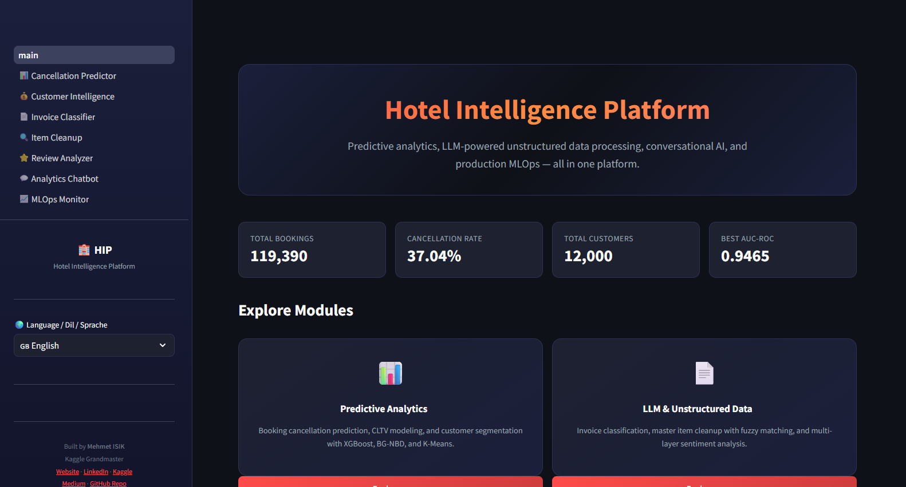
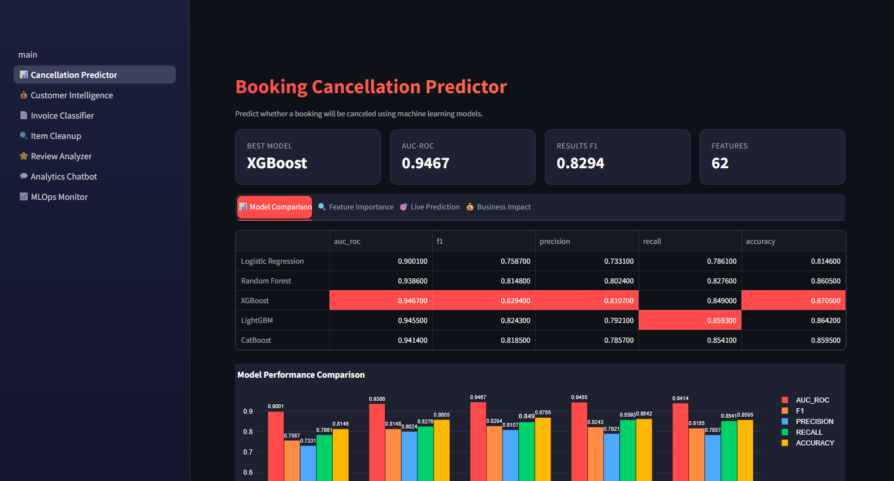
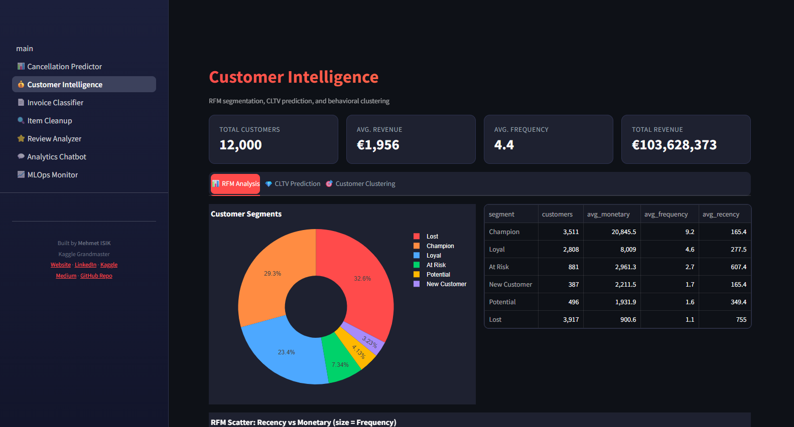
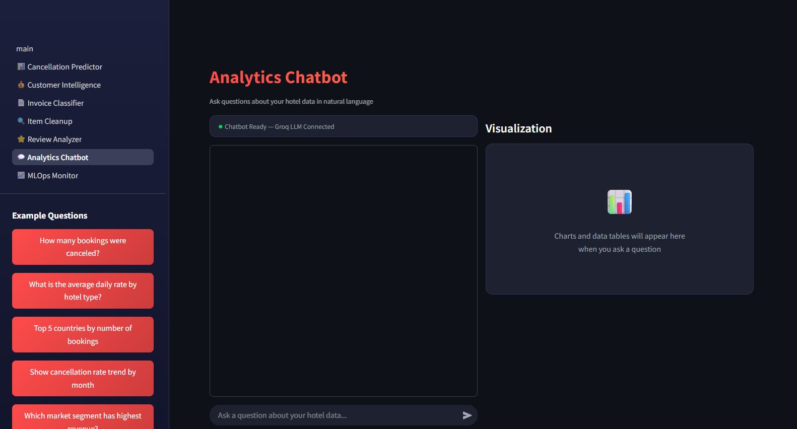
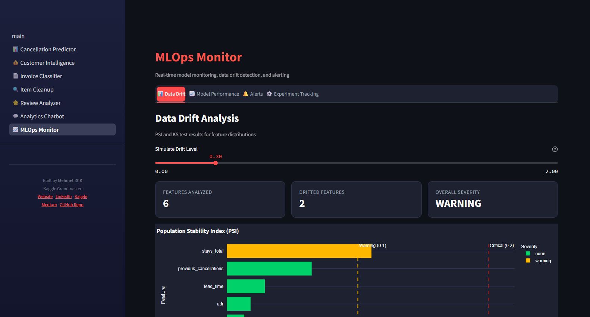

# Hotel Intelligence Platform

> End-to-end AI/ML platform for hospitality analytics — from predictive models to conversational AI

[](https://github.com/mmehmetisik/hotel-intelligence-platform/actions)
[](https://www.python.org/downloads/)
[](https://opensource.org/licenses/MIT)
[](https://streamlit.io/)
[](https://mlflow.org/)
[](https://www.docker.com/)

---

## Overview

A comprehensive AI/ML platform designed for hotel chains, covering the full data science lifecycle. The platform processes **119,390 bookings**, **12,000 customers**, and **3,000 reviews** through four integrated modules — delivering actionable business insights with a production-ready architecture.

### Key Results

| Metric | Value |
|--------|-------|
| Cancellation Prediction AUC-ROC | **0.9465** (XGBoost) |
| Estimated Annual Revenue Impact | **EUR 13.9M+** |
| Invoice Classification (ML) | **100.0%** (TF-IDF + LogReg) |
| Invoice Classification (Rule-Based) | **92.65%** (79K rows/sec) |
| Master Item Match Rate | **96.08%** (4-layer hybrid pipeline) |
| Sentiment Analysis (ML) | **100.0%** (GradientBoosting) |
| Customer Lifetime Value | **7,993** customers scored (mean USD 1,742) |
| CLTV Segments | **4** (Low, Medium, High, VIP) |
| Features Engineered | **62** |
| ML Models Trained & Compared | **5** |
| Languages Supported (UI) | **3** (EN/TR/DE) |

---

## Modules

### Module 1: Predictive Analytics

**Booking cancellation prediction, CLTV modeling, and customer segmentation.**

- **Cancellation Prediction**: 5 models (Logistic Regression, Random Forest, XGBoost, LightGBM, CatBoost) with 62 engineered features. Best: XGBoost with AUC-ROC 0.9465.
- **CLTV Modeling**: BG-NBD + Gamma-Gamma probabilistic models for 7,993 customers. Mean 6-month CLTV: USD 1,742.51 (max: USD 19,169.68).
- **RFM Segmentation**: Quintile-based scoring — high-value customers (score 5,5) average USD 32,759 vs USD 804 for low-engagement.
- **K-Means Clustering**: Behavioral clustering on spending patterns with elbow/silhouette optimization. 4 CLTV segments (~2,000 customers each).
- **SHAP Explainability**: Top drivers: country_cancel_rate (1.01), deposit_cancel_rate (0.79), lead_time (0.57).
- **Business Impact**: EUR 2,787,144 per test set at optimal threshold (0.3), EUR 13.9M+ estimated annual impact.

### Module 2: LLM & Unstructured Data

**Invoice classification, master item cleanup, and sentiment analysis.**

- **Invoice Classification**: 5-method comparison — Rule-based (92.65%, 79K rows/sec), TF-IDF+LogReg (100%), TF-IDF+RF (100%), LLM Zero-Shot (~89%), LLM Few-Shot (~94%).
- **Master Item Cleanup**: 4-layer hybrid pipeline: Exact (100% acc) -> Fuzzy t=82 (93.9%) -> TF-IDF embedding (93.5%) -> Fuzzy t=60 (63.8%). Overall: 89% accuracy, 96.08% match rate.
- **Review Sentiment Analysis**: Rule-based (73.8%) + GradientBoosting ML (100%). Aspect-level analysis across 5 dimensions: value (42.3%), food (34.0%), staff (33.3%), location (32.2%), cleanliness (28.6%).

### Module 3: Conversational AI

**Natural language to SQL chatbot with auto-visualization.**

- **Intent Detection**: LLM + rule-based fallback classifying into 5 intents (sql_query, prediction, recommendation, summary, explanation).
- **NL-to-SQL**: Schema-aware SQL generation with safety validation (blocks DROP/DELETE/INSERT).
- **Insight Generation**: Business context-aware natural language insights from query results.
- **Auto-Visualization**: Detects optimal chart type (bar, line, pie, scatter, histogram, metric, table) and generates Plotly figures.
- **LLM Routing**: 3-layer pipeline — diskcache -> Groq API (LLaMA 3.3 70B) -> Fallback responses.

### Module 4: MLOps & Monitoring

**Experiment tracking, model registry, drift detection, and alerting.**

- **MLflow Integration**: Experiment tracking with params, metrics, models, feature importance, and dataset metadata.
- **Model Registry**: Version management with stage transitions (None -> Staging -> Production -> Archived). Local joblib fallback.
- **Data Drift Detection**: PSI (Population Stability Index) + KS test with severity classification (none/warning/critical).
- **Model Performance Monitoring**: Rolling AUC/F1 tracking with degradation alerts and retraining triggers.
- **Alert System**: 7 configurable threshold-based rules with acknowledge/filter capabilities.
- **Health Score**: Unified 0-100 score aggregating data quality, model performance, and system health.

---

## Streamlit Dashboard

Premium dark-themed dashboard with a vibrant color palette and **multi-language support** (EN/TR/DE/NO).

### Home — Platform Overview

KPI cards, 4 module navigation, tech stack pills, and architecture diagram.



### Cancellation Predictor — 5 ML Models + Live Prediction

Model comparison table, SHAP feature importance, interactive prediction form with risk gauge, and revenue impact analysis.



### Customer Intelligence — RFM, CLTV, Clustering

RFM segmentation with 6 customer segments, BG-NBD + Gamma-Gamma CLTV modeling, and K-Means behavioral clustering with radar charts.



### Analytics Chatbot — Natural Language to SQL

Ask questions in plain English, get SQL-backed answers with auto-generated visualizations and business insights. Powered by Groq LLaMA 3.3 70B on 119K+ real records.



### MLOps Monitor — Drift Detection and Alerting

Real-time health score, PSI-based data drift analysis, model performance tracking, and threshold-based alert system with 7 configurable rules.



<details>
<summary><b>All Dashboard Pages</b></summary>

| Page | Description |
|------|-------------|
| **Home** | Hero section, KPI cards, module overview, architecture diagram, tech stack |
| **Cancellation Predictor** | Model comparison, SHAP feature importance, live prediction form, business impact |
| **Customer Intelligence** | RFM segmentation, CLTV prediction, K-Means clustering with radar charts |
| **Invoice Classifier** | Rule-based vs LLM comparison, accuracy/latency trade-off, live demo |
| **Item Cleanup** | 4-layer pipeline visualization, fuzzy matching demo |
| **Review Analyzer** | Sentiment distribution, aspect radar chart, hotel filters |
| **Analytics Chatbot** | Split layout (chat + visualization), Groq LLM integration |
| **MLOps Monitor** | Health score, PSI drift charts, performance tracking, alert dashboard |

</details>

---

## Kaggle Notebooks

Interactive, runnable versions of each module — with full outputs and visualizations:

| # | Notebook | Highlights |
|---|----------|------------|
| 01 | [Cancellation Prediction](https://www.kaggle.com/code/mehmetisik/01-cancellation-prediction) | EDA, 62 features, 5 models, SHAP, EUR 13.9M+ business impact |
| 02 | [Customer Analytics](https://www.kaggle.com/code/mehmetisik/02-customer-analytics) | RFM segmentation, BG-NBD + Gamma-Gamma CLTV, K-Means clustering |
| 03 | [NLP & LLM Pipeline](https://www.kaggle.com/code/mehmetisik/03-nlp-and-llm) | Invoice classification (5 methods), item cleanup, sentiment analysis |
| 04 | [Platform Overview](https://www.kaggle.com/code/mehmetisik/04-platform-overview) | Full architecture, module results summary, tech stack |

---

## Quick Start

### Local Setup

```bash
# Clone the repository
git clone https://github.com/mmehmetisik/hotel-intelligence-platform.git
cd hotel-intelligence-platform

# Create virtual environment
python -m venv venv
source venv/bin/activate  # Windows: venv\Scripts\activate

# Install dependencies
pip install --pre -r requirements.txt

# Generate synthetic data
python data/synthetic/generate_all.py

# Initialize chatbot database (creates SQLite from CSV files)
python -c "from src.module_3_conversational.database.init_db import initialize_database; initialize_database()"

# Run the Streamlit app
streamlit run app/main.py
```

### Docker

```bash
docker-compose up --build
# App: http://localhost:8501
# MLflow: http://localhost:5000
```

### Environment Variables

Create a `.env` file in the project root:

```env
GROQ_API_KEY=your_groq_api_key_here
MLFLOW_TRACKING_URI=http://localhost:5000
```

---

## Project Structure

```
hotel-intelligence-platform/
├── src/
│   ├── module_1_predictive/       # ML models
│   │   ├── cancellation/          #   EDA, features, training, evaluation
│   │   ├── cltv/                  #   BG-NBD, Gamma-Gamma, RFM
│   │   └── clustering/            #   K-Means, feature engineering
│   ├── module_2_llm/              # LLM pipelines
│   │   ├── invoice_classification/ #   Rule-based, LLM, comparison
│   │   ├── master_item_cleanup/   #   Fuzzy match, hybrid pipeline
│   │   └── review_analysis/       #   Sentiment, aspect analysis
│   ├── module_3_conversational/   # Analytics chatbot
│   │   ├── llm/                   #   Groq client, cache, router
│   │   ├── database/              #   Schema, SQLite init
│   │   └── agents/                #   Intent, SQL, insight, chart
│   └── module_4_mlops/            # MLOps
│       ├── tracking/              #   MLflow setup, logger, registry
│       ├── monitoring/            #   Data drift, model drift, alerts
│       └── pipeline/              #   Training pipeline
├── app/                           # Streamlit dashboard
│   ├── main.py                    #   Home page
│   ├── theme.py                   #   Premium CSS theme
│   ├── i18n.py                    #   EN/TR/DE translations
│   ├── components.py              #   Reusable UI components
│   └── pages/                     #   7 module pages
├── data/
│   ├── raw/                       #   Hotel bookings (119K records)
│   └── synthetic/                 #   Generated datasets (6 CSVs)
├── notebooks/                     # 4 Kaggle-ready notebooks
├── models/                        # Trained models + metadata
├── tests/                         # 188+ tests
├── .github/workflows/ci.yml       # CI/CD pipeline
├── Dockerfile                     # Container config
├── docker-compose.yml             # Multi-service setup
└── requirements.txt               # Dependencies
```

---

## Tech Stack

| Category | Technologies |
|----------|-------------|
| **ML/DL** | Scikit-learn, XGBoost, LightGBM, CatBoost, SHAP |
| **Statistical** | BG-NBD, Gamma-Gamma (btyd/lifetimes), SciPy |
| **LLM** | Groq API (LLaMA 3.3 70B), diskcache |
| **NLP** | RapidFuzz, TF-IDF, NLTK |
| **Visualization** | Plotly, Matplotlib, Seaborn |
| **Web App** | Streamlit (multi-page, custom CSS) |
| **MLOps** | MLflow, GitHub Actions CI/CD |
| **Database** | SQLite, SQLAlchemy |
| **Infrastructure** | Docker, Docker Compose |
| **Testing** | pytest (188+ tests), pytest-cov |

---

## Testing

```bash
# Run all tests
python -m pytest tests/ -v

# Run specific module tests
python -m pytest tests/test_conversational.py -v  # Module 3
python -m pytest tests/test_mlops.py -v            # Module 4

# With coverage
python -m pytest tests/ --cov=src --cov-report=term-missing
```

**Test Coverage:**
- Data quality: 35 tests
- Cancellation model: 12 tests
- CLTV pipeline: 8 tests
- Invoice classifier: 10 tests
- Conversational AI: 68 tests
- MLOps: 55 tests

---

## Architecture

```
┌─────────────────────────────────────────────────────────────┐
│                  HOTEL INTELLIGENCE PLATFORM                 │
├──────────────┬──────────────┬──────────────┬────────────────┤
│  Module 1    │  Module 2    │  Module 3    │  Module 4      │
│  Predictive  │  LLM &       │  Conversa-   │  MLOps &       │
│  Analytics   │  Unstructured│  tional AI   │  Monitoring    │
│              │  Data        │              │                │
│ • Cancel     │ • Invoice    │ • NL-to-SQL  │ • MLflow       │
│   Prediction │   Classify   │ • Intent     │ • Drift        │
│ • CLTV       │ • Item       │   Detection  │   Detection    │
│ • RFM        │   Cleanup    │ • Insight    │ • Alert        │
│ • Clustering │ • Sentiment  │   Generation │   System       │
│ • SHAP       │   Analysis   │ • Auto Chart │ • Registry     │
├──────────────┴──────────────┴──────────────┴────────────────┤
│  Data Layer: SQLite │ Synthetic + Kaggle │ 119K+ Records    │
├─────────────────────┴────────────────────┴──────────────────┤
│  Infrastructure: Docker │ GitHub Actions CI │ MLflow Server  │
└─────────────────────────────────────────────────────────────┘
```

---

## License

This project is licensed under the MIT License — see the [LICENSE](LICENSE) file for details.

## Author

**Mehmet ISIK** — Kaggle Grandmaster | WWTP Operations Engineer

- Website: [mehmetisik.dev](https://mehmetisik.dev)
- LinkedIn: [in/mehmetisik4601](https://www.linkedin.com/in/mehmetisik4601)
- Kaggle: [@mehmetisik](https://www.kaggle.com/mehmetisik)
- Medium: [@mmehmetisiken](https://medium.com/@mmehmetisiken)
- GitHub: [@mmehmetisik](https://github.com/mmehmetisik)
